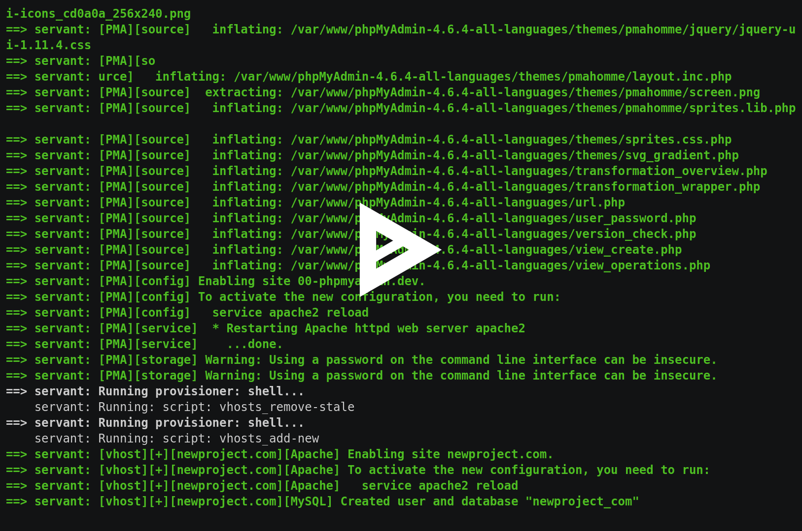

Welcome to servant's documentation!
===================================

**servant** is a custom Vagrant virtual machine which offers a straightforward and easy to use web-development system based on services like `Apache <https://httpd.apache.org/>`_, `PHP (FPM) <http://php-fpm.org/>`_, `MySQL <https://www.mysql.com/>`_ and `phpMyAdmin <https://www.phpmyadmin.net/>`_, but isolated from your host system. Primary goal is to provide a consistent dev environment for developers or employees of a small company/startup.

Features
~~~~~~~

- Isolated from OS X host system (OS updates won't affect the dev services, ever)
- Performant (PHP-FPM and OPcache module enabled)
- Easily add and remove projects (virtual hosts), **servant** automatically creates the necessary web server configurations as well as a MySQL database
- Automatically write/update `/etc/hosts` file on your Mac
- Supports PHP 5.6 and alternatively 5.6
- Supports MySQL 5.6 and alternatively 5.6

.. toctree::
   :maxdepth: 2
   :caption: Getting started

   requirements
   installation
   general

.. toctree::
   :maxdepth: 2
   :caption: Usage

   installation

Indices and tables
==================

* :ref:`search`
