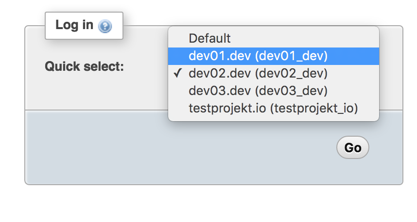

.. _mysql:

MySQL databases
===============

When you setup a virtual hosts, the system also creates a MySQL database and user dedicated to that project. For simplicity's sake the database, username as well as the password represent (again) the hostname of your project. However, because of some naming restrictions within MySQL, dots (``.``) are replaced with underscores (``_``) and only the first 16 characters of the hostname is used. Some examples:

- If your project is using the hostname "testproject.io", the database, username and password will be ``testproject_io``
- If the hostname is "prettylonghostname.com", it'll be ``prettylonghostna``

System credentials
~~~~~~~~~~~~~~~~~~

The following credentials are created by default in every **servant** environment:

+------------+------------------------------------------+
| Username   | Password                                 |
+============+==========================================+
| root       | The password set in :ref:`configuration` |
+------------+------------------------------------------+
| phpmyadmin | ``phpmyadmin``                           |
+------------+------------------------------------------+

phpMyAdmin
~~~~~~~~~~

To manage your databases you can use the builtin phpMyAdmin: `<http://phpmyadmin.dev>`_

Create MySQL backups/dumps
~~~~~~~~~~~~~~~~~~~~~~~~~~

To create a SQL backup or dump file you just need to create an empty file named ``create-mysql-backup`` in the root folder of your project / virtual host (not the ``htdocs`` folder!) and reload **servant**: ::

    cd public/testproject.io
    touch create-mysql-backup

    vagrant provision

The formula dumps all available databases that you might created with the given MySQL user of that virtual host. As soon as the privisioning process is completed, you can find your backups in the ``backup/` folder within your project root: ::

    cd public/testproject.io
    ls -l backups

::

    -rw-r--r--  1 user  staff  1283 18 Sep 13:34 201609171334_testproject_io.sql
    -rw-r--r--  1 user  staff  1283 18 Sep 00:30 201609180030_testproject_io.sql

Import MySQL backups/dumps
~~~~~~~~~~~~~~~~~~~~~~~~~

In case you need to import an existing dump, maybe even right when the project gets bootstrapped during the creation process, rename your dump to ``import.sql`` and place it within your project root folder. After that reload **servant**: ::

    cd public/testproject.io
    mv /path/to/dump.sql import.sql

    vagrant provision

Destruction backups
~~~~~~~~~~~~~~~~~~~

In case you destory the Vagrant machine, there is a hook that creates backups of every MySQL database before proceeding to destroy the machine. You can find the backups right within ``public/`` folder, prefix with ``pre-destroy_``: ::

    cd public
    ls -l

::

    drwxr-xr-x  6 user  staff      204 18 Sep 00:31 testproject.io
    drwxr-xr-x  6 user  staff      204 18 Sep 00:30 testproject2.io
    -rw-r--r--  1 user  staff   660906 18 Sep 00:55 pre-destroy_mysql.sql
    -rw-r--r--  1 user  staff     1284 18 Sep 00:55 pre-destroy_testproject2_io.sql
    -rw-r--r--  1 user  staff     1283 18 Sep 00:55 pre-destroy_testproject_io.sql
    -rw-r--r--  1 user  staff  1688732 18 Sep 00:55 pre-destroy_performance_schema.sql
    -rw-r--r--  1 user  staff    19082 18 Sep 00:55 pre-destroy_phpmyadmin.sql
